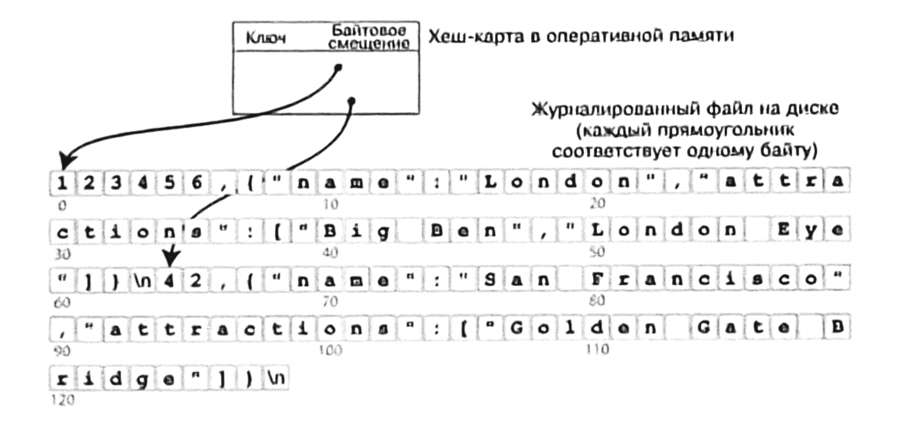
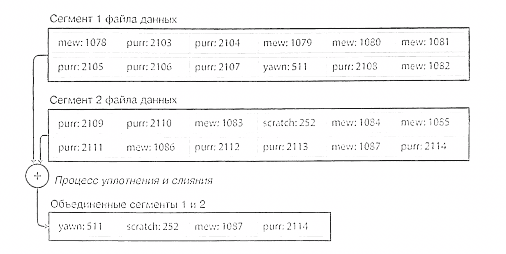

## хеш-таблица
- данные хранятся в файле, который можно только дополнять (append-only log)
- в оперативной памяти хранится хеш-таблица (словарь)
- ключ → смещение (offset) в файле данных

**Запись**: добавляем пару “ключ-значение” в конец файла и обновляем хещ-таблицу
**Чтение**: по ключу находим смещение в хеш-таблице, переходим по нему в файле и читаем значение

### Сегменты

- Разбить журнал на сегменты фиксированного размера.
- При заполнении сегмента - закрыть его и начать новый
- Запустить фоновый процесс уплотнения (compaction) и слияния (merging) сегментов

### Уплотнение

- Удаление дубликатов ключей
- Сохранение только самой последней версии значения для каждого ключа

### Слияние 
- Объединение нескольких небольших сегментов в один новый
- Позволяет уменьшить общее количество сегментов

### Алгоритм чтения:
- Поиск начинается в хеш-таблице самого свежего сегмента
- Если ключ не найден – проверяется следующий по старшинству сегмент
- И так далее, пока ключ не будет найден или не будут проверены все сегменты

### Только добавление
- Высокая производительность записи: Последовательная запись на диск намного быстрее случайной
- Надежность: Упрощение конкретного доступа и восстановление после сбоев (нет риска “полузаписанных” данных)
- Борьба с фрагментацией: Процесс слияния сегментов естественным образом переписывает данные в компактном виде
## Ограничение 
- Ключи должны помещаться в ОЗУ. Хеш-таблица на диске медленная из-за случайных чтений, дорогого расширения и сложности разрешения коллизий.
- Неэффективные запросы по диапазону. Невозможно быстро найти все ключи от 00000 до 99999. Необходимо обращаться к хеш-таблице для каждого ключа в диапазоне отдельно.

## SS-table

### Особенности 
- Данные отсортированы по ключу
- Каждый ключ встречается только один раз (обеспечивается уплотнением)
- Порядок записи значений не важен - приоритет у более новых значений

### Слияние
- Алгоритм, аналогичный сортировке слиянием
- Работает даже когда данные не помещаются в оперативной памяти
- При конфликте ключей берется значение из самого нового сегмента

### Разряженный индекс

- Не нужно хранить все ключи - только некоторые ориентиры
- Пример: известны смещения для "handbag" и "handsome" → "handiwork" между ними
- Можно быстро просканировать небольшой диапазон

### MemTable
- Сбалансированное дерево в оперативной памяти (красно-черное, AVL)
- Данные сохраняются отсортированными по ключу
- Быстрая вставка в любом порядке
### Надежность 
- Все операции немедленно записываются в журнал
- Журнал неупорядочен - используется только для восстановления
- После записи MemTable в SS-таблицу журнал удаляется

### Алгоритм работы
- Запись: Добавляется в MemTable и параллельно пишется в журнал для надежности
- Чтение: Поиск в MemTable → последнем сегменте - предыдущем и т.д.
- Фоновые процессы: При превышении лимита MemTable записывается в SS-таблицу, Регулярное слияние и уплотнение сегментов

### Фильтр Блума
- Эффективная проверка отсутствия ключа
- Избегание ненужных чтений с диска
- "Возможно есть" / "Точно нет"

## Write-Ahead Log
- Файл только для добавления (append-only)
- Быстрая последовательная запись
- Используется для восстановления после сбоев

## Защелки (latches)

- Облегченные версии блокировок
- Защита структур данных при одновременном доступе
- Высокая производительность

- LSM-деревья: Обычно быстрее при записи
- В-деревья: Обычно быстрее при чтении

## Модель доступа

### Дискреционная модель доступа

- Модель управления доступом, при которой владельцы объектов (например, таблиц, схем, представлений) в базе данных самостоятельно определяют, кто и какие действия может выполнять с этими объектами.

## Роли
- B PostgreSQL понятие "пользователь" является частным случаем роли. Каждая роль может иметь или не иметь возможность входа в систему (login privilege). Если у роли установлено свойство LOGIN, она может использоваться как учетная запись пользователя.
- Роли могут быть членами других ролей. Это позволяет организовать группы пользователей - например, создать роль developers, которой будут принадлежать все разработчики, и назначить этой роли общие привилегии.

- Создание CREATE ROLE (Name} {attr, attr2, ...}
- Изменение ALTER ROLE developer WITH PASSWORD 'newsecret';
- LOGIN
- SUPERUSER
- CREATEDB
- CREATEROLE
- PASSWORD 'secret'

### Наследование привилегий
- роль, являющаяся членом другой роли, по умолчанию автоматически наследует все привилегии (права доступа) этой родительской роли.
- GRANT role1 to role2
- REVOKE role1 FROM role2

#### Привилегии таблиц
- SELECT
- INSERT
- UPDATE
- REFERENCES
- DELETE
- TRUNCATE
- TRIGGER

### Привилегии БД
- CREATE
- CONNECT
- TEMPERARY

%%Оффтоп
Truncate

- TRUNCATE не проверяет каждую строку для удаления, а просто освобождает данные, удаляя содержимое таблицы целиком.
- Вместо того, чтобы логировать каждое удаление строки, TRUNCATE записывает в журнал меньший объем информации.
- При использовании TRUNCATE не вызываются триггеры, определенные для операций удаления.
- Если TRUNCATE выполняется в транзакционном блоке, то операция может быть отменена командой ROLLBACK до фиксации транзакции.%%
  
### Привилегии схем
- CREATE
- USAGE
- Права доступа к схеме влияют на возможность создания новых объектов, но сами по себе не контролируют доступ к уже существующим объектам. Для этого необходимо назначать соответствующие привилегии непосредственно на уровне объектов

🌱 Авторы: \
salt-caramel \
notakeith