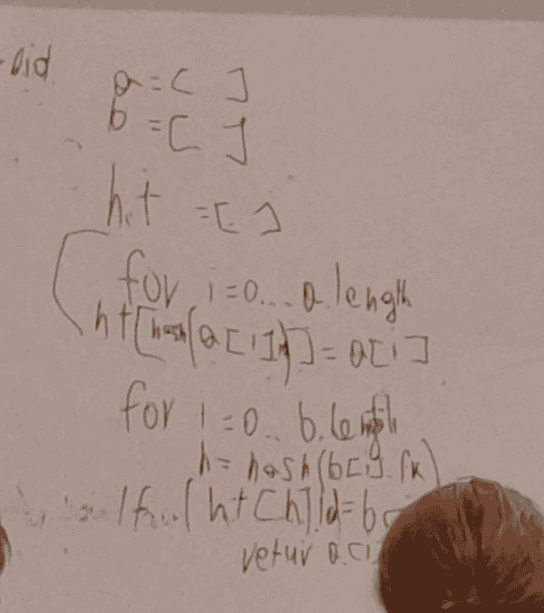
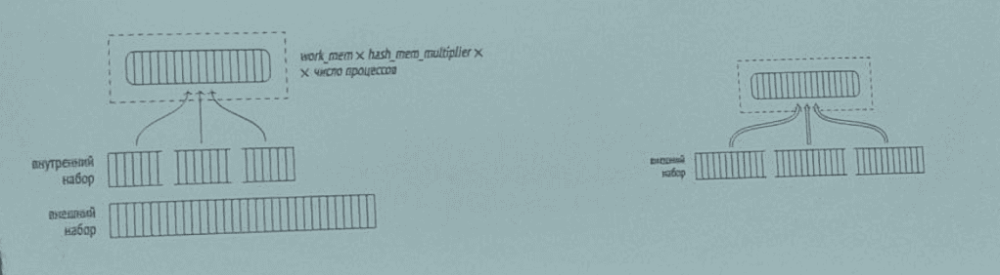
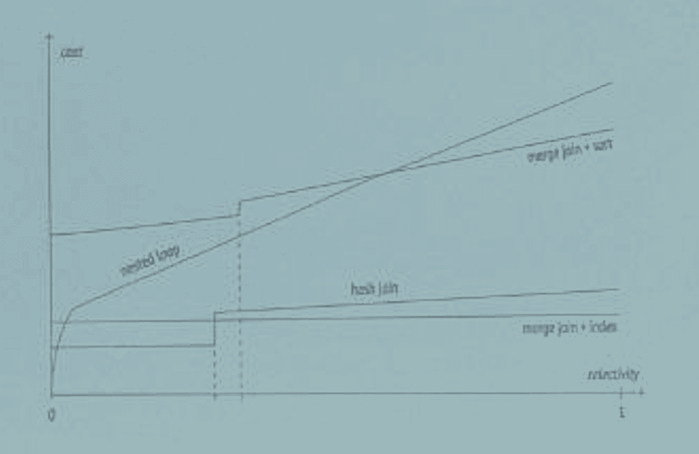

# Этапы выполнения запроса

### Лексический разбор

- На этом этапе сервер принимает SQL-текст запроса и анализирует его на наличие синтаксических ошибок. Результатом является дерево разбора (parse tree), представляющее структуру

### Семантический разбор

- Заменяет представления на их определения или обрабатывает правила, определённые для таблиц.
- Проверка прав у пользователя к этим объектам.
- Вся необходимая для семантического анализа информация хранится в системном каталоге.
- Семантический анализатор получает от синтаксического анализатора дерево разбора и перестраивает его, дополняя ссылками на конкретные объекты базы данных, указанием типов данных и другой информацией.

### Планирование

- Любой запрос можно выполнить разными способами.
- План выполнения также представляется в виде дерева, но его узлы содержат не логические, а физические операции над данными.
- Текстовое представление плана выводит команда EXPLAIN
- Планировщик (planner) принимает переписанное дерево запроса и генерирует один или несколько вариантов выполнения запроса.
- Оптимизатор оценивает стоимость каждого варианта плана, используя статистические данные о таблицах, и выбирает наиболее выгодный план.

### Планы

- Количество возможных планов экспотенциально зависит от количества соединяемых таблиц.
- Для сокращения пространства перебора традиционно используется алгоритм динамического программирования в сочетании с некоторыми эвристиками.
- Точное решение задачи оптимизации не гарантирует, что найденный план действительно будет лучшим.

### Выбор лучшего плана

#### Общие и частные планы

- При выполнении подготовленных запросов план выполнения может быть сохранён и повторно использован.
- Общий план, который строится один раз без учёта конкретных значений параметров, предоставленных во время исполнения.
- Частный План, который создаётся при каждом выполнении подготовленного запроса и учитывает конкретные значения параметров.

- При первом выполнении подготовленного запроса PostgreSQL планирует его с учётом переданных параметров частный план. Однако, если запрос будет выполнен многократно, система переходит к общему плану.
- Если общее выполнение оказывается более выгодным по суммарным затратам, то PostgreSQL будет использовать общий план для последующих вызовов.

## Выполнение

- После выбора оптимального плана исполнитель запускает последовательность операций, предусмотренных планом. Он последовательно проходит по узлам плана.
- При выполнении запросов осуществляется доступ к данным через буферный менеджер, который минимизирует количество операций ввода-вывода на диск.
- Если запрос рассчитан на параллельное выполнение, результат собирается из нескольких рабочих процессов и объединяется в итоговый набор данных.

## Определение
- это набор данных, который собирается системой для оценки распределения значений в таблицах и столбцах, что затем используется планировщиком запросов для выбора наиболее эффективного плана выполнения.

# Статистика
### Хранение

- PostgreSQL хранит собранную статистику в системной таблице pg_statistic
- Прямой доступ к pg_statistic обычно не требуется, и для просмотра статистики чаще используют представление pg_stats
- Это публичное представление, которое предоставляет информацию из pg_statistic в удобном для чтения виде, без избыточных деталей, доступных только суперпользователям.
- Базовая статистика уровня отношения хранится в таблице pg_class

## Данные
- reltuples: число кортежей в отношении.
- n_distinct: оценка количества уникальных значений.
- most_common_vals и most_common_freqs: список наиболее часто встречающихся значений и их частоты.
- histogram_bounds: границы гистограммы распределения значений, которые используются для оценки селективности диапазонных запросов.
- correlation: оценка корреляции между порядком значений в столбце и порядком их хранения.
- null_frac: Доля неопределенных значений

## Сбор статистики

- Статистика собирается при анализе, ручном или автоматическом. Однако ввиду особой важности базовая статистика рассчитывается также при выполнении некоторых операций (VACUUM FULL и CLUSTER, CREATE INDEX и REINDEX) и уточняется при очистке.
- Для анализа случайно выбираются 300 x default_statistics_target строк. Поскольку размер выборки, достаточной для построения статистики заданной точности, слабо зависит от объема анализируемых данных, размер таблицы не учитывается.

## pg_stats

- Для уточнения оценки при неравномерном распределении собирается статистика по наиболее часто встречающимся значениям и частоте их появления. Представление pg_stats показывает два этих массива в столбцах most_common_vals и most_common_freqs.
- Список частых значений используется и для оценки селективности условий с неравенствами. Например, для условия вида «столбец < значение»: надо найти в most common_vals все значения, меньшие искомого, и просуммировать частоты из most_common_ freqs.

- Поле correlation представления pg_stats показывает корреляцию между физическим расположением данных и логическим порядком в смысле операций сравнения. Если значения хранятся строго по возрастанию, корреляция будет близка к единице; если по убыванию - к минус единице. Чем более хаотично расположены данные на диске, тем ближе значение к нулю.
- Корреляция используется для оценки стоимости индексного сканирования.

# Табличные методы доступа

## Последовательное сканирование
- полностью читается файл основного слоя таблицы. На каждой прочитанной странице проверяется видимость каждой версии строки
- Чтение происходит через буферный кеш; чтобы большие таблицы не вытесняли полезные данные. При этом другие процессы, одновременно сканирующие ту же таблицу, присоединяются к кольцу и тем самым акономят операции дисковых чтений. Поэтому в общем случае сканирование может стартовать не о начала файла
- Последовательное сканирование - самый аффективный способ прочитать всю таблицу или значительную ее часть. Иными словами, последовательное сканирование хорошо работает при низкой селективности.

Агрегация

- Hash Aggregation
- GroupAggregate

- Входные данные должны быть отсортированы по ключам группировки
- Данные читаются в отсортированном порядке, и когда встречается новое значение ключа группировки, текущая группа завершается
- Не требует хранения всей хеш-таблицы в памяти

# СТЕ

• Идея была в том, что если какой-то вложенный подзапрос используется в запросе несколько раз, то его можно определить как общее табличное выражение и ссылаться на него столько раз, сколько потребуется. В этом случае PostgreSQL вычислит результаты только один раз и повторно использует их при повторных обращениях.

# Shared buffers

• Представляют собой оперативную память, где PostgreSQL хранит копии страниц таблиц и индексов. Когда запрос требует доступ к данным, сервер сначала ищет их в этом кэше. Если страница найдена (hit), запрос выполняется быстрее, чем в случае обращения к диску.

# Explain

- Тип операций (узлов) плана
- Оценки стоимости (cost). cost=START_COST..END_COST
- Оценка количества строк
- Размер данных (width)
- Параллельное выполнение
- Фактическое время выполнения. Время, затраченное на выполнение каждой операции.
- Фактическое количество строк. Сколько строк реально обработано на каждом этапе.
- Число циклов/итераций

# Виды и способы соединений

## Соединение хешированием

• Реализация использует динамически расширяемую хеш-таблицу с разрешением коллизий с помощью цепочек, как для буферного кеша.

## Соединение хешированием в параллельных планах

- Соединение хешированием очень эффективно для больших наборов данных. При наличии достаточного объема оперативной памяти оно требует однократного просмотра двух наборов данных, то есть имеет линейную сложность.

- Соединение слиянием работает для наборов данных, отсортированных по ключу соединения, и возвращает отсортированный же результат. Входной набор может оказаться уже отсортированным в результате индексного сканирования, или он может быть отсортирован явно.
- Используется Быстрая сортировка, Частичная пирамидальная сортировка, внешняя сортировка слиянием.

# Сортировки

- PostgreSQL использует quicksort, чтобы выполнить операцию в оперативной памяти. Размер выделенной памяти для сортировки контролируется параметром work_mem.
- Если объем данных превышает значение work_mem, PostgreSQL может производить сортировку с временным сохранением промежуточных результатов на диске.
- В новых версиях PostgreSQL поддерживается параллельное выполнение операций сортировки.

# Табличные методы доступа / Последовательное сканирование

- полностью читается файл основного слоя таблицы. На каждой прочитанной странице проверяется видимость каждой версии строки
- Чтение происходит через буферный кеш; чтобы большие таблицы не вытесняли полезные данные. При этом другие процессы, одновременно сканирующие ту же таблицу, присоединяются к кольцу и тем самым экономят операции дисковых чтений. Поэтому в общем случае сканирование может стартовать не с начала файла.
- Последовательное сканирование - самый эффективный способ прочитать всю таблицу или значительную ее часть. Иными словами, последовательное сканирование хорошо работает при низкой селективности.

- В оценке стоимости оптимизатор учитывает две составляющие: дисковый ввод-вывод и ресурсы процессора
- Стоимость ввода-вывода рассчитывается как произведение числа страниц в таблице на стоимость чтения одной страницы, при условии что страницы читаются последовательно.
- Соотношение по умолчанию подходит для HDD-дисков; для накопителей SSD имеет смысл существенно уменьшить значение параметра random_page_cost (значение seq_page_cost, как правило, не трогают, оставляя единицу в качестве опорного значения).
- Оценка ресурсов процессора учитывает стоимость обработки каждой версии строки (которая определяется для планировщика значением параметра сри_tuple_cost):
- Если на сканируемую таблицу наложены условия, они отображаются в плане запроса под узлом Seq Scan в секции Filter. Оценка числа строк будет учитывать селективность этих условий, а оценка стоимости - затраты на их вычисления.

## Parallel Seq Scan - «параллельное последовательное сканирование».

- чтение выполняется несколькими параллельно работающими процессами. Процессы синхронизируются между собой с помощью специально отведенного участка общей памяти, чтобы не прочитать одну и ту же страницу дважды.

## Gather
- собирает результаты от параллельных рабочих процессов.
- Gather Merge: В этом случае параллельные рабочие процессы выполняют сортировку локально, а Gather Merge объединяет отсортированные потоки, гарантируя, что итоговый результат также будет отсортирован без выполнения дополнительной сортировки на этапе объединения.

## Табличные методы доступа
### Сканирование только индекса

- Операция представляется в плане запроса узлом Index Only Scan
- На оценку сканирования только индекса влияет доля табличных страниц, отмеченных в карте видимости.

### Сканирование по битовой карте

- Ограничение индексного сканирования связано с тем, что при уменьшении корреляции увеличивается количество обращений к страницам, а характер чтения меняется с последовательного на случайный.

### Сравнение методов доступа
- Зависимость стоимости различных методов доступа от селективности условий можно представить следующим образом
- Стоимость индексного сканирования сильно зависит от корреляции.  
    При идеальной корреляции индексное сканирование эффективно даже при довольно большой доле выбираемых строк.

## Соединение вложенным циклом
- эффективность соединения вложенным циклом влияет нескольких условий: кардинальность внешнего набора строк, наличие метода доступа ко внутреннему набору, позволяющего эффективно получить нужные строки, повторные обращения к одним и тем же строкам внутреннего набора.
- В общем случае полная стоимость соединения складывается: из стоимости получения всех строк внешнего набора, однократной стоимости первоначального получения всех строк внутреннего набора (в ходе которого выполняется материализация), (N-1) кратной стоимости повторного получения строк внутреннего набора, стоимости обработки каждой строки результата.

